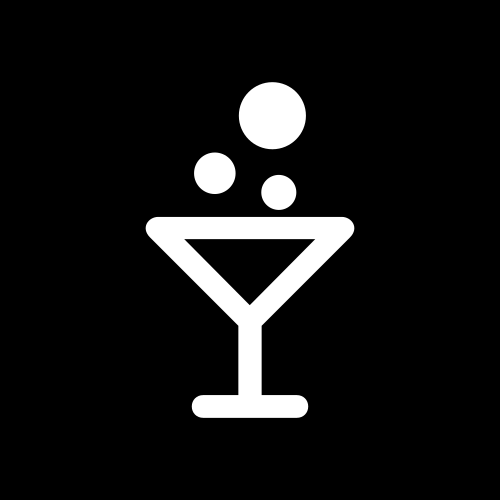

<div align="center">
	
	<h1>DiscoUI Capacitor</h1>
	<p>Capacitor plugin for DiscoUI: Metro-inspired UI primitives with splash, frame navigation, and pivot pages across Android, Electron, and Web.</p>
</div>

## Quick Start
```bash
npm install discouicapacitor
npx cap sync
```

## Usage
Create a disco.config.json in your app public root (for example, www/disco.config.json):

```json
{
	"theme": "dark",
	"accent": "#D80073",
	"font": "SegoeUI",
	"splash": {
		"mode": "manual",
		"color": "#008a00",
		"icon": "./favicon.svg",
		"showProgress": true
	}
}
```

Then create and launch the app:
```ts
import { DiscoApp } from 'discouicapacitor';

const app = new DiscoApp();
app.launch(document.querySelector('disco-frame'));
```

### Theming
Set theme and accent on the `<html>` tag:
```html
<html disco-theme="auto" disco-accent="#d80073" disco-font="Segoe UI">
```

## Project Structure
- `src/` — Capacitor plugin implementation
- `example-app/` — Android demo app (Vite)
- `android/` — Native Android plugin

## Development
- `npm run build` — build the plugin bundle
- `npm run build:android` — build debug APK for the example app

## License
This project is licensed under the [MIT License](LICENSE).

## Contact

For any inquiries or feedback, feel free to reach out!

<a href="https://www.buymeacoffee.com/cherryhoax" target="_blank"></a>